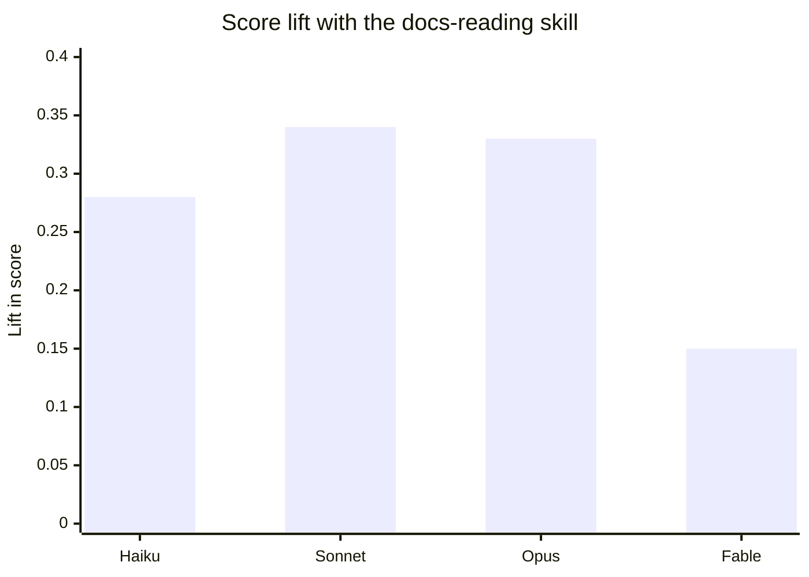

# Agent Knowledge Hub

An agentic learning and knowledge management system where agents do the teaching, you do the learning.

Built for the DevFest Sydney 2026 Builder Showcase. This is tonight's working slice: install the plugin, fetch the Gemini API docs, and ask Claude about them. **The full plugin is coming Thursday 8 October.**

## The story

> My agents kept getting the docs wrong, so I built them a library. Then it became how I learn anything.

1. **April 2026.** I started learning AI agents with Claude Code. The agents kept getting their own setup wrong, such as writing skills, because they did not read their docs properly.
2. **The library.** I turned an old 100 dollar PC into a home server that mirrors the docs and pulls every change. Agents look things up instead of guessing.
3. **The proof.** The skills my agents wrote got clearly better. The chart is below.
4. **The flip.** The same mirrors now teach me. Matt Pocock's teach skill builds cited lessons and quizzes from a mirror, in my Obsidian vault. My own hub covers 21 tools so far.
5. **What it is.** Karpathy's LLM Wiki and Google's Open Knowledge Format (OKF) showed me what I had built: a knowledge system. Next, every lesson becomes an OKF bundle that any agent can read, Claude or Gemini.

This repo is a small, fresh copy of that pattern that you can install.

## Does it help?

An eval of skill writing, scored from 0 to 1, before and after giving the agent a skill that reads the mirrored docs before it writes. The chart shows the lift per model.



| Model | Before | After | Lift |
| --- | --- | --- | --- |
| Haiku | 0.37 | 0.65 | +0.28 |
| Sonnet | 0.48 | 0.82 | +0.34 |
| Opus | 0.59 | 0.92 | +0.33 |
| Fable | 0.71 | 0.86 | +0.15 |

**The honest caveat:** the lift comes from the skill itself, not from fresh docs. Later doc-driven updates to that skill added almost nothing on Sonnet and Opus (+0.04 and +0.05, inside the noise).

## Install

You need [Claude Code](https://code.claude.com/docs/en/overview) and Python 3.10 or later: [Windows](https://docs.python.org/3/using/windows.html), [macOS](https://docs.python.org/3/using/mac.html), [Linux](https://docs.python.org/3/using/unix.html).

```bash
claude plugin marketplace add ssud11/agent-knowledge-hub
claude plugin install agent-knowledge-hub@agent-knowledge-hub-marketplace
```

Inside a Claude Code session, the same two steps are `/plugin marketplace add ssud11/agent-knowledge-hub` and `/plugin install agent-knowledge-hub@agent-knowledge-hub-marketplace`.

## Try it

1. Start Claude Code and ask a Gemini API question, for example: "How long can a Gemini managed agent environment sit idle before it is stopped?"
2. The first time, there is no mirror yet. Claude says so and gives you the one command that fetches the Gemini API docs (about 200 pages, a few minutes). Run it, or ask Claude to run it.
3. Ask again. Claude finds the topic in the mirror's index, reads the page, and cites the file it read.

The mirror goes to `agent-knowledge-hub-mirror` in your home folder. The pages are fetched to your machine and are never stored in this repo.

## How it works

- **The mirror.** `fetchers/llms_txt_fetcher.py` reads a site's `llms.txt`, fetches every listed page as markdown, and writes an `INDEX.md`. Every run writes a change summary to `CHANGES.txt`: pages added, changed and removed, by content hash. A failed page keeps its old copy, requests pause between pages, and it refuses to wipe most of a mirror at once. Python standard library only.
- **The read-the-docs skill.** Before answering about a mirrored tool, the agent looks the topic up in the index, reads the page, and cites the file. A page in the mirror outranks the model's memory.
- **Teach** (Thursday). A new-study skill sets up a study folder whose rules make every lesson claim cite its mirror page. The lessons come from Matt Pocock's teach skill, which you install from [his repo](https://github.com/mattpocock/skills); it is not copied here.
- **OKF** (Thursday). A sample lesson, also written as an [OKF v0.2](https://github.com/GoogleCloudPlatform/knowledge-catalog/blob/main/okf/SPEC.md) bundle.

## Coming Thursday

- Onboarding: choose where your mirrors live, with a test fetch to prove it works.
- A `/refresh` command that updates the mirror and prints what changed.
- add-docs: mirror any other tool with decent docs.
- new-study: the teach link.
- A sample lesson and its OKF bundle.

## Credits

- [Matt Pocock's skills](https://github.com/mattpocock/skills), for the teach skill.
- [Google's Open Knowledge Format](https://github.com/GoogleCloudPlatform/knowledge-catalog/blob/main/okf/SPEC.md).
- [Andrej Karpathy's LLM Wiki](https://gist.github.com/karpathy/442a6bf555914893e9891c11519de94f).

## License

MIT. See [LICENSE](LICENSE).
