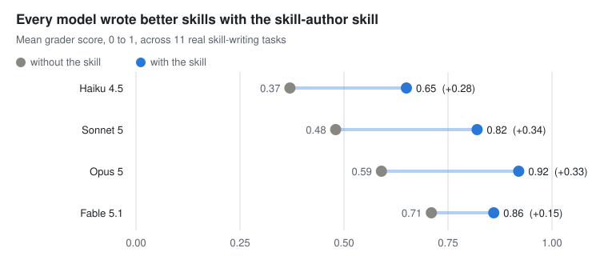

# Agent Knowledge Hub

An agentic learning and knowledge management system where agents do the teaching, you do the learning.

Agents answer questions about tools from memory, and memory is often wrong or out of date. Agent Knowledge Hub gives an agent a local, self-updating mirror of a tool's documentation and one rule: read the mirror before answering, and cite the page. The same mirror then feeds lessons that teach you the tool.

## Results

Before: each model writes Claude Code skills on its own. After: it uses a skill that reads the mirrored docs first. Graded 0 to 1 across 342 runs, every model scored higher after.

<picture>
  <source media="(prefers-color-scheme: dark)" srcset="assets/eval-chart-dark.svg">
  
</picture>

| Model | Before | After | Lift |
| --- | --- | --- | --- |
| Haiku | 0.37 | 0.65 | +0.28 |
| Sonnet | 0.48 | 0.82 | +0.34 |
| Opus | 0.59 | 0.92 | +0.33 |
| Fable | 0.71 | 0.86 | +0.15 |

## Install

Requires [Claude Code](https://code.claude.com/docs/en/overview) and Python 3.10 or later ([Windows](https://docs.python.org/3/using/windows.html), [macOS](https://docs.python.org/3/using/mac.html), [Linux](https://docs.python.org/3/using/unix.html)).

```bash
claude plugin marketplace add ssud11/agent-knowledge-hub
claude plugin install agent-knowledge-hub@agent-knowledge-hub-marketplace
```

Inside a Claude Code session, run `/plugin marketplace add ssud11/agent-knowledge-hub` and then `/plugin install agent-knowledge-hub@agent-knowledge-hub-marketplace`.

## User Guide

1. Start Claude Code and ask a question about the Gemini API. For example: "How long can a Gemini managed agent environment sit idle before it is stopped?"
2. On the first run there is no mirror yet. Claude says so and gives you the one command that fetches the Gemini API docs, about 200 pages in a few minutes. Run it, or ask Claude to run it.
3. Ask again. Claude finds the topic in the mirror's index, reads the page, and cites the file it read.

By default, the mirror is stored in `agent-knowledge-hub-mirror` in your home folder. Pages are fetched to your machine and never committed to this repo.

## Set up, refresh, add tools, learn

- **Onboarding.** Right after installing, ask Claude to "set up the knowledge hub". The onboarding skill asks where to keep your mirrors (it suggests `agent-knowledge-hub-mirror` in your home folder), saves the choice, adds the Gemini API docs to your sites file, and proves it works with a small test fetch. It ends with `DRY RUN PASSED` or `DRY RUN FAILED`; it does not claim success otherwise. Run it again any time to move the mirror.
- **Refresh.** `/agent-knowledge-hub:refresh` re-fetches every mirrored site and prints what was added, changed and removed, with a page count per site.
- **Add a tool.** Ask Claude to "mirror the docs of" a tool, or to add it to the hub. The add-docs skill checks what kind of site it is. A site with an `llms.txt` takes one line in your sites file. A GitHub repo of markdown docs or an HTML site gets a small fetcher written for it. Either way it ends with a dry run. Your sites file and any written fetchers live in the plugin's data folder, which survives updates.
- **Start a study.** Ask Claude to "start a new study" on a topic, for example Gemini function calling. The new-study skill creates a study folder whose `CLAUDE.md` requires every lesson claim to cite the mirror page it came from, plus a practice folder beside it.
- **Teach.** The lessons come from Matt Pocock's teach skill, which is installed separately:

  ```bash
  claude plugin marketplace add https://github.com/mattpocock/skills.git
  claude plugin install mattpocock-skills@mattpocock
  ```

  Then start Claude Code inside the study folder, so its `CLAUDE.md` loads, and run `/mattpocock-skills:teach` with your topic.
- **Example.** [`examples/find-session-lesson`](examples/find-session-lesson) holds a lesson written this way, a short Gemini function calling lesson with a `find_session(time)` Python snippet, and the same lesson as an OKF bundle.

## How it works

- **Mirror.** `fetchers/llms_txt_fetcher.py` reads a site's `llms.txt`, fetches every listed page as markdown, and writes an `INDEX.md`. Each run records what was added, changed and removed in `CHANGES.txt`, by content hash. A failed fetch keeps the previous copy, requests are paced, and the fetcher will not wipe most of a mirror in one run. Python standard library only.
- **Read-the-docs skill.** Before answering about a mirrored tool, the agent finds the topic in `INDEX.md`, reads the page, and cites the file. The mirror takes priority over the model's memory.
- **Onboarding skill.** Asks where to keep your mirrors, suggests your home folder, saves the choice, and confirms it with a test fetch.
- **Refresh command.** `/agent-knowledge-hub:refresh` updates the mirror and prints what changed.
- **add-docs skill.** Mirrors any other tool with usable documentation. An `llms.txt` site takes one line in the sites file. Other kinds get a fetcher written from the shipped one.
- **Teach.** A new-study skill creates a study folder whose rules require every lesson claim to cite the mirror page it came from. The lessons come from [Matt Pocock's teach skill](https://github.com/mattpocock/skills), installed separately.
- **OKF.** A sample lesson, also packaged as an [OKF v0.2](https://github.com/GoogleCloudPlatform/knowledge-catalog/blob/main/okf/SPEC.md) bundle.

## Credits

- [Matt Pocock's skills](https://github.com/mattpocock/skills), for the teach skill.
- [Google's Open Knowledge Format](https://github.com/GoogleCloudPlatform/knowledge-catalog/blob/main/okf/SPEC.md).
- [Andrej Karpathy's LLM Wiki](https://gist.github.com/karpathy/442a6bf555914893e9891c11519de94f).

## License

MIT. See [LICENSE](LICENSE).
